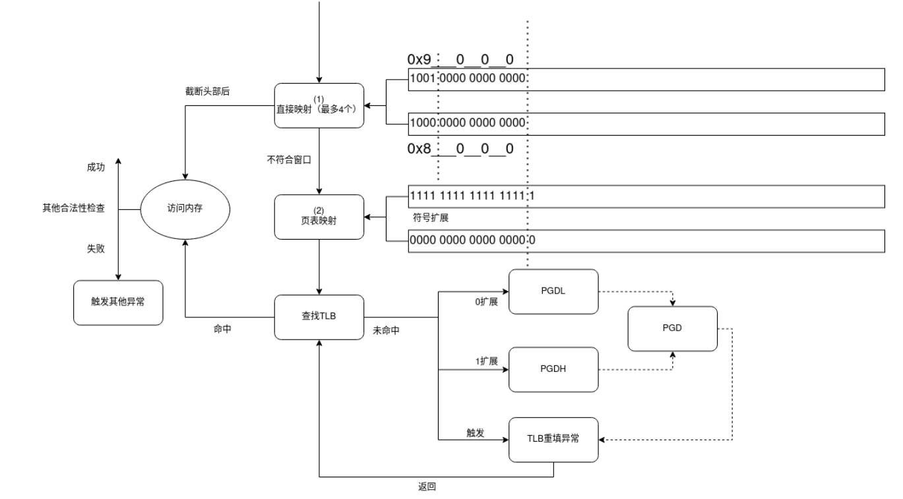
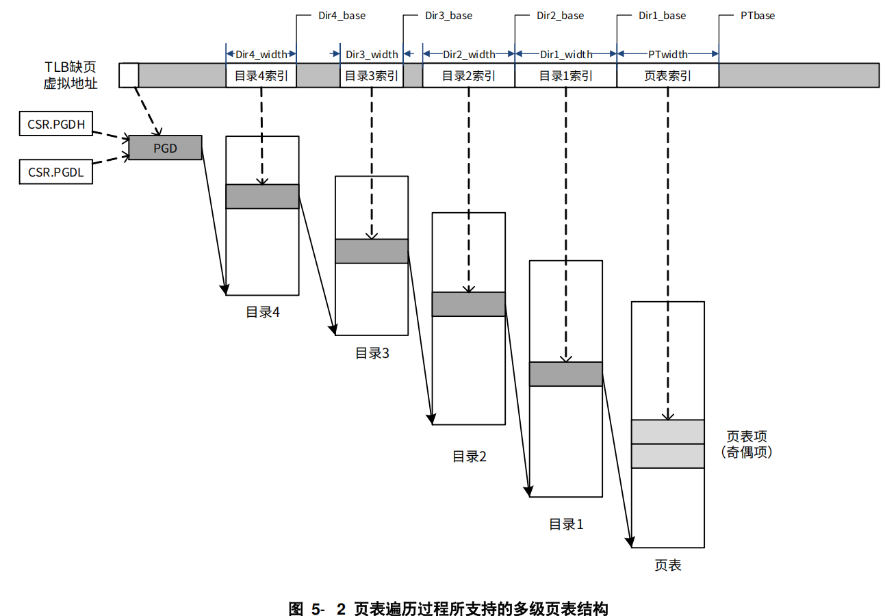
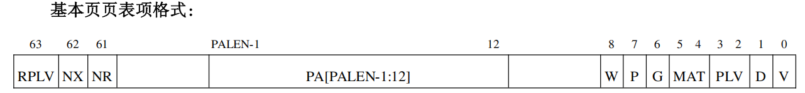

# loongarch64开发

trust_os 是只支持 riscv64 架构的，需要我们完成向 loongarch64 的迁移。本文档只记录迁移过程中和 riscv64 架构不同的部分。

## 内核初始化流程

在启动qemu评测命令后，qemu 执行默认的 bios 后，将跳转到我们设置的内核入口点，即 os/src/arch/loongarch64/qemu/asms/entry.asm 文件中的 \_start 函数，在 \_start 函数中，只进行栈空间初始化

\_start 函数执行后跳转到 init_csr_regs 函数，该函数负责初始化 csr 寄存器，完成设置直接映射窗口、设置中断和异常配置、设置映射翻译模式以及设置页表相关参数，随后跳转到多架构通用的 rust_main 函数，执行一般的初始化。

## 地址空间

龙芯MMU支持两种地址翻译模式（通过设置CSR.CRMD的DA和PG字段）

- 直接地址翻译模式

  - CPU复位后默认模式，此时整个虚拟地址空间可用，任何地址在某位截断后，低位当做物理地址使用

- 映射地址翻译模式

  - 直接映射模式

    > 举例来说，在 PALEN 等于 48 的情况下，通过将 DMW0 配置为 0x11，那么在 PLV0级下，0x9000_0000_0000_0000~0x9000_FFFF_FFFF_FFFF 这段原本在页映射模式下不合法的虚地址空间，将被映射到物理地址空间 0x0~0xFFFF_FFFF_FFFF 上，且存储访问类型是一致可缓存的。

  - 页表映射模式

    > 翻译地址时将优先看其能否按照直接映射模式进行翻译，无法进行后再按照页表映射模式进行翻译。




在翻译模式下，内核地址空间如下

- 0x9000_0000_0000_0000 ~ 0x9000_ffff_ffff_ffff：本段为直接映射窗口，内核地址0x9000_xxxx_xxxx_xxxx对应物理地址 0Xxxxx_xxxx_xxxx
- 0xffff_ffff_0000_0000：本段为内核的页表映射，其中包含了 MMIO 映射（这是为了单独将 MMIO 地址设为非缓存）、用户态信号跳板函数（为了单独将该页设为用户可访问）

用户地址空间和 riscv 一致，均为：0 ~ 0x2f_ffff_ffff

## 页表实现

loongarch64 的页表是由


## 中断和异常

TODO

## devices

TODO：

## 其他工作

TODO

时钟、串口输入输出

## 参考

TODO

#### 条件编译中存在的互斥条件

每个项目（比如os和user）的`Cargo.toml`文件，在 `[features]` 选项可能存在 `default`，这是为了让vscode不产生红色波浪线报错，如果编译出错，请检查`default`中的feature与cargo build传入的feature是否冲突（例如，default有`riscv64`而cargo build传入`--feature=loongarch64`，则会报错

kernel 的 debug_level 之间也存在互斥

#### 在用户程序实现了la64的编译

- 在user/dotcargo/config文件中添加：（参考NPUcore-IMPACT）

  ```
      "-Clink-arg=-nostdlib",
      "-Clink-arg=-static",
      "-Cpanic=abort"
  ```

  并且由于要配套loongarch64-unknown-linux-gnu编译工具，在文件中还指定了linker = "loongarch64-linux-gnu-gcc，以支持la64

- 由于指定`-Clink-arg=-nostdlib`，所以在user/arch文件夹下给链接器提供了一些函数

- 修改了system_call的调用处代码

#### la64的gdb

来自：https://github.com/LoongsonLab/oscomp-toolchains-for-oskernel

#### 关于vendor

vendor目录不能手动修改，在os（或者user）下运行cargo vendor会将Cargo.toml中的依赖项复制（或者下载）到vendor目录下，覆盖修改。如果想要定制vendor中的库，请将其放到项目外的目录A下（即os或者user目录之外），并修改os或者user的Cargo.toml中的对应依赖的path为目录A

为了解决lwext4_rust库间接引用的cty库不支持la64的问题，将cty修改后放下lwext4_rust文件夹中，并修改了os/Cargo.toml让cty的引用重定向

在os/vendor下引用库loongArch64（https://github.com/Godones/loongArch64.git），提供了读写寄存器等辅助函数

#### 特权级

la64有四个特权级，PLV0~PLV3。只有PLV0可以使用特权指令（如CSR指令）。所处特权级由CSR.CRMD（当前模式信息寄存器）中的PLV域决定。

由上，设置内核态位于PLV0，用户态位于PLV3

#### 地址空间

这部分参考了龙芯架构参考手册（LoongArch-Vol1-v1.10-CN）第五章，NPUcore的mm.pdf文档

物理地址空间范围为 $0 \sim 2^{PALEN}-1$，PALEN由CPUCFG指令获得，tatlin_os中该值为48

龙芯MMU支持两种地址翻译模式（通过设置CSR.CRMD的DA和PG字段）

- 直接地址翻译模式

  - CPU复位后默认模式，此时整个虚拟地址空间可用，任何地址被低位截断后当做物理地址使用

- 映射地址翻译模式（如下图所示）

  - 直接映射模式

    - 参考手册原文：

      > 举例来说，在 PALEN 等于 48 的情况下，通过将 DMWO 配置为 0x11，那么在 PLV0级下，0x9000_0000_0000_0000~0x9000_FFFF_FFFF_FFFF 这段原本在页映射模式下不合法的虚地址空间，将被映射到物理地址空间 0x0~0xFFFF_FFFF_FFFF 上，且存储访问类型是一致可缓存的。

  - 页表映射模式


由图可知，如果访问的虚拟地址的PALEN位是0，则从PGDH寄存器读出页表的ppn到PGD，然后查询；如果是1，则读出PGDL

> 采用页表映射模式时，合法虚拟地址的 [63, VALEN] 位必须与 [VALEN-1] 位相同，否则出发地址错（ADE）例外

#### 存储访存类型

由页表项的MAT域（具体可见架构手册2.1.7节）

| 类型       | 是否进入缓存 | 是否保证先后顺序   | 适用范围                                                   |
| ---------- | ------------ | ------------------ | ---------------------------------------------------------- |
| 一致可缓存 | 是           | 否（允许一定重排） | 代码、堆栈等，一般都用这个                                 |
| 强序非缓存 | 否           | 是（强顺序）       | MMIO、外设寄存器                                           |
| 弱序非缓存 | 否           | 否（允许重排）     | DMA 缓冲区、与设备共享的数据结构（需要内存一定的内存屏障） |

#### 页表

请参考架构手册5.4.5

> CSR.PWCL和 CSR.PWCH用来配置 LDDIR和 LDPTE指令所遍历页表的规格参数信息

查询页表的过程（我们设置了三级页表，图中为四级），图中的DirX_width和DirX_base需要手动设置相关寄存器





**使用sv39方案**

qemu模拟的la64CPU的 VALEN=48，PALEN=48

开启虚地址缩减模式

> 为了在某些应用场合减少页表级数，LA64架构下还提供了一种虚地址缩减模式。当系统软件将CSR.RVACFG 寄存器中的 RDVA 配置为 1~8中的一个值时,映射地址翻译模式下虚拟地址的有效位将按照(VALEN-RDVA)这么多位来处理。例如，在一台 VALEN=48 的处理器上，当 RDVA 配置为8时，合法地址的[63:40]位需要是第[39]位的符号扩展。

以第38位区别内核和用户地址空间

内核地址空间：0xffff_ffc0_0000_0000 ~ 0xffff_ff....ff

用户地址空间：0x0 ~ 0x0000_003F_FFFF_FFFF

**关于tlb**

>  若未在 TLB 中命中，则需要将页表内容从内存中取出并填入 TLB 中，这一过程通常称为 TLB 重填（TLB Refill）。 TLB 重填可由硬件或软件进行，riscv64，即由硬件完成页表遍历 （Page Table Walker），将所需的页表项填入 TLB 中；而 LoongArch 默认采用软件 TLB 重填，即查找 TLB 发现不命中时，将触发 TLB 重填异常，由异常处理程序进行页表遍历并进行 TLB 填入。

**关于全局标志位(G)**

>  当该位为 1 时，查找时不进行 ASID 是否一致性的检查。当操作系统需要在所有进程间共享同一虚拟地址时，可以设置 TLB 页表项中的 G 位置为 1。

riscv64中并未涉及到这一方面，未来可以关注G位设置

#### MMIO和串口通信：实现控制台输入输出、关机

使用以下命令得到设备树文件（和CPU相关的信息）

```
qemu-system-loongarch64 -M virt -cpu la464 -nographic -kernel kernel-la -machine dumpdtb=ladtb.dtb
dtc -I dtb -O dts ladtb.dtb -o ladtb.dts
```

由设备树可以得到

- 关机：向地址 `0x100e001c` 写入 `0x34`
- 控制台输入输出的串口地址：`0x1fe001e0`，使用标准的 NS16550 UART 控制器

我们启用了0x9000起始的直接映射窗口，所以上面的两个物理地址需要加上0x9000_0000_0000_0000实现访问

注意：

**MMIO 区域会导致物理内存地址空间中的“空洞”（Hole）** ，也就是说：

- 虽然物理地址是连续的，但某些地址范围被外设占用，不能用来存放数据或代码
- 实际可用 RAM 是多个不连续的地址块

在将物理内存交给CMA管理时需要考虑这一部分（不过初赛的内存为128MB，而上面的串口和关机地址都大于128MB）

#### 异常

la64中三类异常处理

- 用户态异常
  -  __alltraps -> trap_handler -> trap_tretunr 
- tlb重填异常
  - __tlb_rfill
- 内核态其他异常


？？？TODO：整合arch模块对外的异常类型

#### 改进

是不是可以不使用直接地址翻译模式，即不使用0x9000开头的地址？如果不使用直接翻译，则需要再启用页表之时，保证启用前后的指令均能被CPU访问到（开启了页表后的下一条指令地址，即PC+4就不合法了）

#### 参考

[1. LoongArch介绍 — The Linux Kernel documentation](https://www.kernel.org/doc/html/latest/translations/zh_CN/arch/loongarch/introduction.html)

[多级页表硬件机制 - rCoreloongArch-tutorial](https://godones.github.io/rCoreloongArch/mmu.html)

------

[Fediory/NPUcore-IMPACT: “全国大学生计算机系统能力大赛 - 操作系统设计赛(全国)- OS内核实现赛道龙芯LA2K1000分赛道” 一等奖参赛作品](https://github.com/Fediory/NPUcore-IMPACT/tree/NPUcore-FF)

[LoongsonLab/StarryOS-LoongArch: Port Starry OS to LoongArch64 Platform](https://github.com/LoongsonLab/StarryOS-LoongArch)

[Junkher/xv6-loongarch: OS2022-Proj95](https://github.com/Junkher/xv6-loongarch/tree/main)