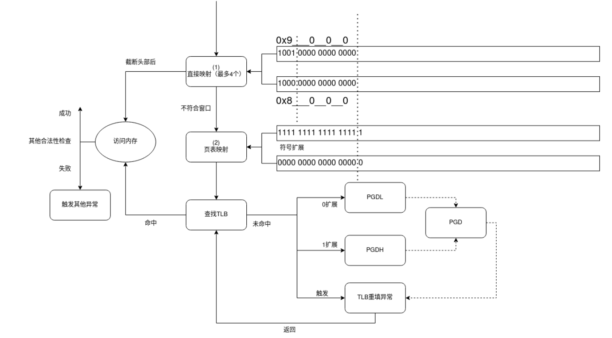
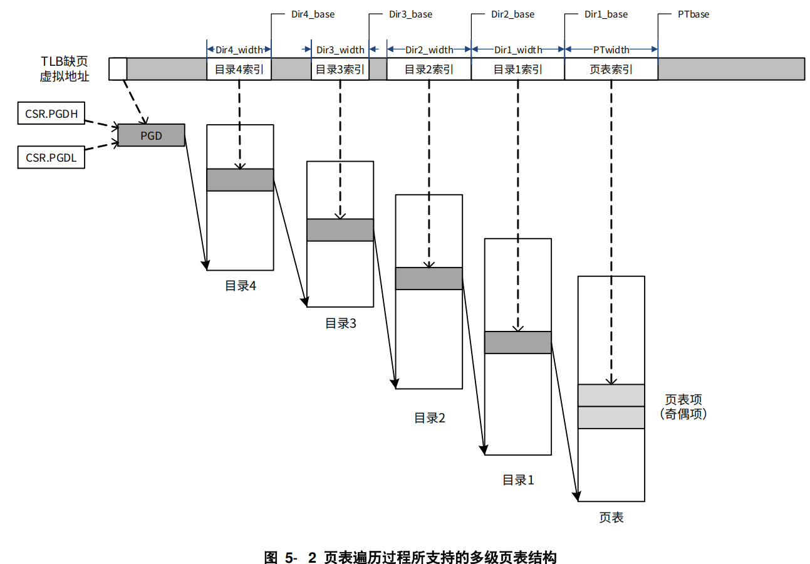
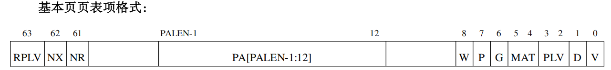

# loongarch64迁移

trust_os 是只支持 riscv64 架构的，需要我们完成向 loongarch64 的迁移。本文档只记录迁移过程中和 riscv64 架构不同的部分。

## 内核初始化流程

在启动qemu评测命令后，qemu 执行默认的 bios 后，将跳转到我们设置的内核入口点，即 os/src/arch/loongarch64/qemu/asms/entry.asm 文件中的 \_start 函数，在 \_start 函数中，只进行栈空间初始化

\_start 函数执行后跳转到 init_csr_regs 函数，该函数负责初始化 csr 寄存器，完成设置直接映射窗口、设置中断和异常配置、设置映射翻译模式以及设置页表相关参数，随后跳转到多架构通用的 rust_main 函数，执行一般的初始化。

## 地址空间

龙芯MMU支持两种地址翻译模式（通过设置CSR.CRMD的DA和PG字段）

- 直接地址翻译模式

  - CPU复位后默认模式，此时整个虚拟地址空间可用，任何地址在某位截断后，低位当做物理地址使用

- 映射地址翻译模式

  - 直接映射模式

    > 举例来说，在 PALEN 等于 48 的情况下，通过将 DMW0 配置为 0x11，那么在 PLV0级下，0x9000_0000_0000_0000~0x9000_FFFF_FFFF_FFFF 这段原本在页映射模式下不合法的虚地址空间，将被映射到物理地址空间 0x0~0xFFFF_FFFF_FFFF 上，且存储访问类型是一致可缓存的。

  - 页表映射模式

    > 翻译地址时将优先看其能否按照直接映射模式进行翻译，无法进行后再按照页表映射模式进行翻译。




在翻译模式下，内核地址空间如下

- 0x9000_0000_0000_0000 ~ 0x9000_ffff_ffff_ffff：本段为直接映射窗口，内核地址0x9000_xxxx_xxxx_xxxx对应物理地址 0Xxxxx_xxxx_xxxx
- 0xffff_ffff_0000_0000：本段为内核的页表映射，其中包含了 MMIO 映射（这是为了单独将 MMIO 地址设为非缓存）、用户态信号跳板函数（为了单独将该页设为用户可访问）

用户地址空间和 riscv 一致，均为：0 ~ 0x2f_ffff_ffff

## 页表实现

根据 loongarch 基础架构手册，多级页表的结构如下图所示（图中为四级页表，DirX_width和DirX_base需要手动设置相关寄存器）



为了和 riscv 架构下尽量统一，loongarch64 的页表同样为三级页表，并且每个页的大小为 4096 字节。页表相关的 csr 寄存器初始化设置如下。

```rust
/// 初始化csr寄存器
#[no_mangle]
pub fn init_csr_regs() {
    ...
    // 设置当前模式寄存器
    // 设置特权级，启用分页
    crmd::set_plv(CpuMode::Ring0);
    crmd::set_da(false); // 启用分页（和set_pg一起发挥作用）
    crmd::set_pg(true);
    crmd::set_datf(MemoryAccessType::CoherentCached); // 直接翻译的取指访存类型
    crmd::set_datm(MemoryAccessType::CoherentCached); // 直接翻译的load/store访存类型
    crmd::set_we(true);

    ...
    
    // 设置页表参数
    tlbidx::set_ps(PAGE_SIZE_BITS);
    stlbps::set_ps(PAGE_SIZE_BITS);
    tlbrehi::set_ps(PAGE_SIZE_BITS);
    pwcl::set_pte_width(8);

    // 页表结构配置
    pwcl::set_ptbase(12);
    pwcl::set_ptwidth(9);
    pwcl::set_dir1_base(12 + 9);
    pwcl::set_dir1_width(9);
    pwcl::set_dir2_base(12 + 9 + 9);
    pwcl::set_dir2_width(9);
    pwch::set_dir3_base(0);
    pwch::set_dir3_width(0);
    pwch::set_dir4_base(0);
    pwch::set_dir4_width(0);
    
    ...
}
```

根据基础手册可知 loongarch64 的基本页表项格式如下（各个标志位的含义可见基础架构手册）。



我们默认页表映射的物理页是经过缓存的，所以页表项中的 MAT 标志位总是“一致可缓存”。P 标志位（表示是否存在对应的物理页）是由软件管理的，我们将其置为恒1。D 标志位在 tlb 中表示该页是否被修改过，和 riscv 不同，D 标志位是由软件管理的，需要在触发 PageModifyFault 例外时修改。页表项第9个比特位（从0计数）是空闲位，和 riscv 一致，我们将其设为 COW 位，用于写时复制。

由于 loongarch64 和 riscv64 的页表项标志位不完全相同，需要设计二者统一的页表项标志位，以便给页表调用者提供统一的接口。统一的标志位接口表示如下。

```rust
bitflags! {
    // 页表项标志位
    pub struct PTEFlags: usize {
        const VALID = 1 << 0;       // 有效位
        const READABLE = 1 << 1;    // 可读
        const WRITEABLE = 1 << 2;   // 可写
        const EXECUTABLE = 1 << 3;  // 可执行
        const USER = 1 << 4;        // 用户态访问
        const COW = 1 << 9;         // 写时复制
    }
}
```

目录项结构和 riscv 不同，loongarch64 的目录项的值仅为子一级页表项/目录项所在的物理页的页首地址，实现的 find_pte 如下。

```rust
fn find_pte(&self, vpn: VirtPageNum) -> Option<&mut PageTableEntry> {
    let idxs = vpn.indexes();
    let mut ppn = self.root_ppn;
    for (i, idx) in idxs.iter().enumerate() {
        if ppn.0 == 0 {
            return None;
        }
        if i == 2 {
            let pte = &mut ppn.as_array::<PageTableEntry>()[*idx];
            return Some(pte);
        } else {
            let next = ppn.as_array::<usize>()[*idx];
            ppn = PhysAddr::from(next).floor();
        }
    }
    return None;
}
```

设置和切换页表需要关注的寄存器为 pgdl 和 pgdh，由于 tatlin_os 的内核和进程共用页表，所以可以将这两个寄存器视为一个寄存器，存放的是当前页表的根物理地址。当启用某个页表时，将 pgdl 和 pgdh 同时设为该页表的根物理地址，并刷新 tlb 缓存即可。

## 异常处理

在本文中，中断（Interrupt）是指外部事件（如时钟信号）引发的，例外（Exception）是指在指令执行过程中发生的异常情况引发的，我们统一将中断和例外称为 “异常” 。

loongarch64 中发生的异常归类为三种，tlb重填异常、机器错误异常、普通异常。

首先介绍 loongarch64 特有的 tlb 重填异常，当访存操作的虚地址在 TLB 中查找没有匹配项时，触发该异常，通知系统软件进行 TLB 重填工作，该异常允许在其他异常处理过程中被触发。而 riscv64 中，tlb 重填是完全由硬件负责的。

tlb重填异常发生时，loongarch64 有一套单独的硬件寄存器保存必要的现场（这里不需要关注），而后会跳转到 tlbrentry 寄存器存放的、单独的处理函数并执行，在执行完成后，将返回异常发生时的地址，恢复必要现场。该处理函数定义如下。

```
        .globl __tlb_rfill
        .section .text.__rfill
        .balign 4096
__tlb_rfill:
        csrwr $t0, 0x8B
        csrrd $t0, 0x1B
        lddir $t0, $t0, 2
        lddir $t0, $t0, 1
        ldpte $t0, 0
        ldpte $t0, 1
        tlbfill
        csrrd $t0, 0x8B
        ertn
```

机器错误异常在比赛任务重基本不会触发，我们在初赛进程中暂时不做处理。

普通异常在特权级的角度，可以分为内核态异常和用户态异常，这两种异常我们将单独处理。普通异常均通过设置 eentry 寄存器来设置异常入口函数的地址，返回用户态前，eentry 将会被设置为用户态普通异常处理函数，而进入内核态后，eentry 将会被设置为内核态普通异常处理函数。我们只需要关心用户态的普通异常。

riscv64 和 loongarch64 来自用户态的异常都包含了页错误例外、时钟中断、系统调用例外，并且二者所需要的用户态异常处理流程非常相似，为了使得系统更容易维护和扩展，我们实现了两个架构中关于异常的统一处理流程，并在合适地地方调用两个架构分别实现的具体处理函数。

当异常发生时，我们需要将两个架构中具体的异常类型转换为统一的异常类型，定义统一异常类型如下。

```rust
#[derive(Debug, Clone, Copy, PartialEq, Eq)]
pub enum Trap {
    Exception(Exception),
    Interrupt(Interrupt),
    Unknown,
}

#[derive(Debug, Clone, Copy, PartialEq, Eq)]
pub enum Exception {
    LoadPageFault,
    StorePageFault,
    FetchInstructionPageFault,
    /// 龙芯特有的PageModifyFault，发生时需要内核将这一页的dirty置为1
    PageModifyFault,
    Syscall,
}

/// The interrupt type.
#[derive(Debug, Clone, Copy, PartialEq, Eq)]
#[repr(usize)]
pub enum Interrupt {
    Timer,
}
```

用户态异常发生时，基本的函数执行路径为 `__alltraps` -> `trap_handler` -> `trap_return` -> `__return_to_user` 。其中，`trap_handler` 函数和 `trap_return` 函数为两个架构通用的处理函数，而 `__alltraps` 和 `__return_to_user` 分别是 loongarch64 的保存和恢复现场的函数。

## devices

TODO

## 其他工作

**串口输入输出、关机**

riscv64 中由 sbi 负责实现这两项功能，而 loongarch64 需要使用操作硬件地址实现。

运行以下命令可以得到设备树文件（和CPU相关的信息）	

```
qemu-system-loongarch64 -M virt -cpu la464 -nographic -kernel kernel-la -machine dumpdtb=ladtb.dtb
dtc -I dtb -O dts ladtb.dtb -o ladtb.dts
```

由设备树可以得到，关机需要向物理地址 `0x100e001c` 写入 `0x34`（注意这里需要以 u8 的形式写入），控制台输入输出的串口地址：`0x1fe001e0`，使用标准的 NS16550 UART 控制器

## 参考

- [2023102309132647981.龙芯架构参考手册卷一_r1p10.pdf](https://www.loongson.cn/uploads/images/2023102309132647981.龙芯架构参考手册卷一_r1p10.pdf)

- [1. LoongArch介绍 — The Linux Kernel documentation](https://www.kernel.org/doc/html/latest/translations/zh_CN/arch/loongarch/introduction.html)

- [多级页表硬件机制 - rCoreloongArch-tutorial](https://godones.github.io/rCoreloongArch/mmu.html)

- [Fediory/NPUcore-IMPACT: “全国大学生计算机系统能力大赛 - 操作系统设计赛(全国)- OS内核实现赛道龙芯LA2K1000分赛道” 一等奖参赛作品](https://github.com/Fediory/NPUcore-IMPACT/tree/NPUcore-FF)

- [LoongsonLab/StarryOS-LoongArch: Port Starry OS to LoongArch64 Platform](https://github.com/LoongsonLab/StarryOS-LoongArch)

- [Godones/rCoreloongArch](https://github.com/Godones/rCoreloongArch)